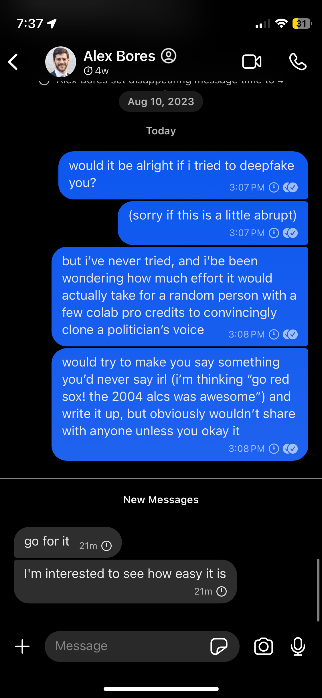

# How to reproduce our work
You can break down our work into seven broad steps:

0. Get permission from the person you're deepfaking
1. Get training data
2. Process training data
3. Train cheap, free online deepfake
4. Train leading proprietary deepfake
5. Fine-tune state-of-the-art text-to-speech model.
6. Evaluate the three deepfakes

Let's go through these one-by-one.

## 0. Get permission from the person you're deepfaking
Okay, this one is hopefully straightforward. This started as a personal curiosity that I adapted into a school project — neither Otto nor I are trying to create political propaganda, and we're definitely not trying to run afoul of the law.

It's very convenient, then, that I spent the summer of 2023 as a legislative aide for New York State Assemblymember Alex Bores. AM Bores doesn't just have a master's in machine learning from Georgia Tech — he's particularly worried about the sudden 

So I asked him — do you mind if I deepfake you?


Fortunately, he said yes.

## 1. Get training data
We were lucky — this step was incredibly straightforward, since Assemblymember Bores had just recorded an hour-long interview for the Max Politics Podcast, which is freely available online, e.g. on Soundcloud [here](https://soundcloud.com/gotham-gazette-max-murphy/assemblymember-alex-bores-on-ai-opportunity-court-reform-housing-policy-more). We used [this tool](https://soundcloudmp3.org) to download the audio, though any of the myriad comparable Soundcloud-to-mp3 tools would've been just as good.

## 2. Process training data


### 2a. Set up programming environment
Before doing any processing, though, it's important to note that we did all our programming in a virtual environment on UChicago's midway computing cluster (why not on our own machines? See [5. Fine-tune state-of-the-art text-to-speech model](#5-fine-tune-state-of-the-art-text-to-speech-model).) To replicate our work, you'll need to install all the packages we used — that'll mean running something like the following in your shell from inside this directory:

```bash
conda create --name <env_name> --file requirements.txt
```

If you're planning to replicate step 5, I'd recommend getting access to a good GPU or two if you want to finish in a reasonable amount of time.

### 2b. Podcast splitting
Once we had the podcast, we had to split out all the parts where the interviewer was talking. I did this with a simple python script, available in `training_data/scripts/split_podcast.py`. Unsurprisingly, the script takes the podcast and splits out the parts where Alex is speaking, saving them to `training_data/MyTTSDataset/wavs`. 

Initially, we split the audio naively, just cutting the audio into the chunks where Alex was talking and skipping over the chunks where he wasn't. This version of `split_podcast.py`, visible [here](https://github.com/henryjosephson/deepfaking-a-politician/blob/a357547c0155d4b56960cd07ff17a7de47798ecf/training_data/scripts/split_podcast.py), worked fine for steps 3 and 4, but we ran into errors when fine-tuning our custom model in step 5 whenever we had a clip which was longer than 250 characters when transcribed (see below), so I edited `split_podcast.py` into the version you see now.

## 3. Train cheap, free online deepfake
Once we had the podcast split into manageable chunks, we looked around online for low-effort deepfake tools — the sort of thing you'd find if you googled "free online deepfake". After a brief bit of searching, we settled on [Vocloner](https://vocloner.com), since they had a relatively-straightforward interface. They offer two different models, and we used version two. We found that quality didn't really change when we varied the clip we chose as reference audio, but we stuck to clip 22 for consistency's sake.

We saved the outputted audios to the `outputs` directory, and all of the vocoder clips have filenames that start with "vocoder". 
<!--make sure this is actually true-->

## 4. Train leading proprietary deepfake
We also looked into businesses that sell voice cloning software, on the assumption that they'd perform better than the free versions. (This assumption was later validated, see [below](#6-evaluate-the-three-deepfakes).) Our search led us to [ElevenLabs](https://elevenlabs.io), a company which, for just $11/month, let us generate several hundred thousand tokens worth of audio. (We never did come close to the limit).

They also offered a 'Professional voice cloning' option, which requires that you verify that the voice is yours — before they let you create a 'professional voice clone,' they'll put a sentence up on the screen, and you need to read it into the microphone within fifteen seconds. If the voice reading the sentence doesn't match the training data, then you get locked out. As I'll describe in section [5d](#5d-not-good-enough-to-fool-elevenlabs), we tried to bypass this, both with our own fine-tuned model and with the base ElevenLabs voice. Alas, neither attempt was successful.

## 5. Fine-tune state-of-the-art text-to-speech model
### 5a. Setup
This is the most involved and most time-consuming part of the project. First, some compute notes — Professor Trimble was kind enough to allow us access to his PI allocation on UChicago's midway compute cluster. We're incredibly grateful for this, because neither Otto nor I have any GPUs, which are essential for all the AI training and inference we did. Thank you!

After a cursory literature review and reading many forum posts from people trying to do the same thing, we settled on Coqui's TTS library -- their github page is [here](https://github.com/coqui-ai/TTS). I chose this in part because they had just released a new model within the last month or so, XTTS v2, but also for ease of use, since they had an example training script available in their git repo. 

When fine-tuning XTTSv2, we needed to provide transcripts of each audio clip in our training set, so we ran OpenAI's Whisper model — this is the `transcribe_wavs_to_metadata.py` file and the `transcribe_wavs_to_metadata.sbatch` slurm job. If you want to replicate this and you're on the midway compute cluster (or some comparable slurm system), you can run
```zsh
sbatch slurm/jobs/transcribe_wavs_to_metadata.sbatch
```
Since I've reorganized the files a bit since running this, though, you might need to update the output path for the logfiles in the sbatch file for it to run correctly. If you submit it as a slurm job and it doesn't run, this is what I'd check first.

If you're just on a personal machine, you should first check that you have enough GPU power to run the transcriptions in a reasonable amount of time. If you do, I'd still read through the slurm job in the above file and make sure you have all the needed dependencies loaded (it won't run without `ffmpeg` -- ask me how I know!), then just run the `training_data/scripts/transcribe_wavs_to_metadata.py` script.

### 5b. Train
Once the metadata file was set, we were (nominally) ready to begin training/fine-tuning. In reality, there was a *lot* of back-and-forth bug-hunting here. I'd run the training script, read the error logs, correct a bug, then do it again. 

I'll spare you a bug-by-bug recount, but one illustrative example is that, apparently, the midway computing cluster has both login nodes and computation nodes, but the compute nodes aren't connected to the internet. Our fine-tuning script initially called a snapshot of a pretrained XTTSv2 model, but the script would always error out, not realizing that it wasn't connected to the internet. I got around this by just taking everything in `train.py` that requires internet access and moving it to `train_prereqs.py`, which I ran on a login node, but this took me much longer to find and correct than I'd like to admit.

Once all the bugs were quashed, though, I hit submit on the slurm job and watched it run. One potential caveat is that we only ran training once, and only for ~42 epochs — if I could go back and do the project again, I'd do many more smaller training runs to try to better tune hyperparameters, then try to do a larger training run on 50+ epochs. That said, it clearly output a serviceable text-to-speech model that approximated Alex's voice.

### 5c. Infer
To produce inference, add all the sentences that you want the model to say as strings to the `stuff_to_say` list in inference.py. You can then either run the inference slurm job by running

```
sbatch slurm/jobs/inference.sbatch
```
on a slurm cluster, or by running the `inference.py` script directly on your GPU machine. Once the script runs, you should have `.wav` files of the model in the outputs directory.

### 5d. Not good enough to fool ElevenLabs
Now, like I mentioned [above](#4-train-leading-proprietary-deepfake), we briefly considered using this custom model to get around the voice verification that ElevenLabs uses to gatekeep their highest-quality cloner. This was a fun challenge, especially because the verification has a 15-second time limit. After piping together a [screenshot-to-text tool](https://github.com/ianzhao05/textshot) and our text-to-speech tool, we eventually found out that ElevenLabs just wasn't convinced that the speaker in the uploaded training files was the same as the voice we were generating to try to fool them (and they were right).

## 6. Evaluate the three deepfakes
Okay, now that we have three ways to generate deepfakes, we need to evaluate them. We did this in two ways: first, by creating a Google form and sharing it with people who have previously worked with Alex, and second by uploading clips to various internet deepfake detectors.

### 6a. Survey
I'm in a group chat with everyone who's worked for Alex Bores before, and I shared a survey with 12 audio recordings — 7 fake, 5 real. You can listen to all of the recordings under `outputs/for-survey`. The same recordings are included as both `wav`s and `mp4`s so that I could upload them to YouTube (as unlisted videos) and thereby embed them in the form.

You can see the live form [here](https://docs.google.com/forms/d/1312gvJJk07z9-HxMLPH62jy3LPdWXILc5RitBq8cui8/edit), and a pdf version is included at `evals/survey/Alex Bores Deepfake Detection (Survey).pdf`. Unfortunately, only four people responded to the survey, so we can't really use it for anything more than superficial vibes. That said, the ElevenLabs recordings were clearly the most convincing fakes — feel free to review the anonymized responses at `evals/survey/Alex Bores Deepfake Detection (Responses) - anonymized.csv` -- people who know the man said pretty consistently that the ElevenLabs recordings were real!

### 6b. Deepfake Detectors

To recreate our deepfake detector tests, as displayed in the writeup:

1. Navigate to the Vocloner and ElevenLabs TTS generation webpages (https://vocloner.com/ and https://elevenlabs.io/app/speech-synthesis). 
    a. For Vocloner, select Version 2.
    b. ElevenLabs will require you to be a paying subscriber to use the base model TTS generation. 

2. Upload training audio. For ElevenLabs, we uploaded all of our training data. For Vocloner, which limits the quantity of training data you can upload, we used the file AlexBoresVoice85.wav. The sentence reads: 

> As just one example, Nvidia, the maker of the chips that are used to actually power AI research, recently took all of their corporate knowledge, all of the bug reports, all of their schematics for chips, and put that into an AI system to help develop new chips. 

3. Output audio for select sentences. We used the following five short sentences, intended to cover a moderately wide range of language formality and disciplines:

> Failure doesn’t mean you are a failure, it just means you haven’t succeeded yet. 

> We will compare this recording against the audio you uploaded in the previous step to verify it’s your voice.

> A liquidity trap is caused when people hold cash because they expect an adverse event such as deflation, insufficient aggregate demand, or war.

> Stirner suggested that communism was tainted with the same idealism as Christianity and infused with superstitious ideas like morality and justice.

> Malicious users could download deepfake software on their personal computers and avoid any degree of oversight. 
	
 We then outputted 5 additional sentences (referenced across from several sources, such as [Clagnut](https://clagnut.com/blog/2380/#English_phonetic_pangrams)) meant to approximately cover the full range of possible English phonemes: 

> With tenure, Suzie would have all the more leisure for yachting, but her publications are no good.

> Are those shy Eurasian footwear, cowboy chaps, or jolly earthmoving headgear?

> The beige hue on the waters of the loch impressed all, including the French queen, before she heard that symphony again, just as young Arthur wanted.

> Shaw, those twelve beige hooks are joined if I patch a young, gooey mouth. 

> Six spoons of fresh snow peas, five thick slabs of blue cheese, and maybe a snack for her brother Bob. 

4. Output this same set of sentences from our own TTS model. (see [5c. Infer](#5c-infer) for instructions)

5. Navigate to the University of Buffalo’s [Deepfake-O-Meter website](https://zinc.cse.buffalo.edu/ubmdfl/deep-o-meter/landing_page), and create a free account.

6. Upload a given audio clip and select the Wroclaw University of Science and Technology's 2023 audio detector option. Select ‘I don’t know’ for whether or not you think a given clip is real or fake from the right-side menu.

    While we tested other detectors, and included the results from the 2023 (and thus more recent) University of Buffalo and Naver Corporation detectors (see `evals/deepfake-detector/Automated Deepfake Detector Results.csv`), we decided to utilize only those results from the Wroclaw detector given their relative accuracy in assessing AI-probabilities for both TTS and real audio.

7. Repeat this process for each sentence created by the three TTS methods. Note that all columns in `evals/deepfake-detector/Automated Deepfake Detector Results.csv` (except for ‘Real Audio’) segment our results by whether or not they belong to the ‘short sentences’ group or ‘phoneme-robust sentences’ group, as denoted by column ‘Clip Type’. 
8. Take the mean of results according to their grouping (Wroclaw detector, TTS method, and audio clip type). 
9. Take a sample of 10 out of the 167 podcast audio clips available in Henry Josephson’s Github under training_data/MyTTSDataset/wavs. We utilized clips AlexBoresVoice1.wav, AlexBoresVoice10.wav, AlexBoresVoice100.wav, AlexBoresVoice101.wav, AlexBoresVoice102.wav, AlexBoresVoice40.wav, AlexBoresVoice50.wav, AlexBoresVoice60.wav, AlexBoresVoice80.wav, and AlexBoresVoice90.wav. 
10. Run each of these clips through the Deepfake-O-Meter platform and settings described in Step 6. Note the results recorded in the csv (right-most column) are NOT segmented by short and phoneme clips, as we don’t have any specifically phoneme-robust clips from Bores. 
11. Take the mean of the Wroclaw detector ‘Real Audio’ results. 
